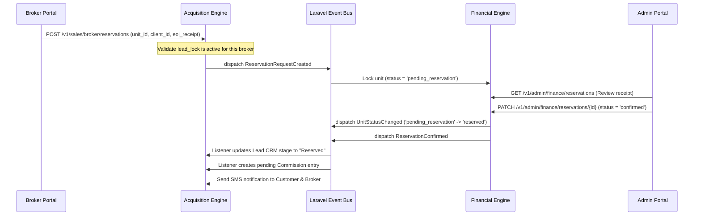

# REDP Broker Mediation Platform
## System Requirements & Dashboard Architecture Blueprint

This document defines the functional requirements, user journeys, data structure, integration protocols, and front-end dashboard architecture for the **Broker Mediation Platform** (Tier 2 and Admin/Sales portals) within the Real Estate Digital Platform (REDP).

---

## 🖥️ 1. Dashboard Architecture Blueprint

The platform is divided into two primary interfaces: the **Broker Portal** (for external partners) and the **Company Sales & Admin Portal** (for internal operations). Below is the layout blueprint and information hierarchy designed to support broker productivity and seamless communication with company sales.

### 1.1 Broker Portal Information Hierarchy (Wireframe Grid)

```
┌────────────────────────────────────────────────────────────────────────────────────────┐
│  REDP LOGO  │ 🏢 Projects  │ 🔑 Inventory  │ 👥 My Leads  │ 💰 Commissions  │ 🔔 [3] Admin   │
├─────────────┴──────────────┴───────────────┴──────────────┴────────────────┴───────────┤
│ 🍊 Welcome, Elite Realty (Active) | Tier 2 Broker                      [Quick Action +]│
├────────────────────────────────────────────────────────────────────────────────────────┤
│                                                                                        │
│  ┌───────────────────────┐ ┌───────────────────────┐ ┌──────────────────────────────┐  │
│  │    ACCURUED REVENUE   │ │     ACTIVE LEADS      │ │     LEADERBOARD RANKING      │  │
│  │   240,000 EGP         │ │   12 Clients Locked   │ │   #3 - Monthly Top Broker    │  │
│  │   [Request Payout]    │ │   [Add New Lead]      │ │   3.2M EGP Volume            │  │
│  └───────────────────────┘ └───────────────────────┘ └──────────────────────────────┘  │
│                                                                                        │
│  ┌───────────────────────────────────────────────┐ ┌──────────────────────────────────┐  │
│  │ 📋 Active Unit Reservations (My Holds)        │ │ 📣 Recent Notifications          │  │
│  │ ───────────────────────────────────────────── │ │ ──────────────────────────────── │  │
│  │ • Unit A104 - Client: Ali Fahmy               │ │ • [System] Commission Approved   │  │
│  │   [Pending Approval] [Expires in 48h]         │ │   for Unit B302 (45,000 EGP)     │  │
│  │ • Unit B201 - Client: Sarah Amin              │ │ • [Price Change] Project Nile    │  │
│  │   [Approved / Active Hold]                    │ │   Towers units updated +5%       │  │
│  └───────────────────────────────────────────────┘ └──────────────────────────────────┘  │
│                                                                                        │
└────────────────────────────────────────────────────────────────────────────────────────┘
```

### 1.2 Portal Page Definitions & Layouts

#### Page A: Home Dashboard (Overview)
- **Key Performance Indicators (KPIs)**: Total Leads, Active Locks, Pending Reservations, Accrued Commission (Pending vs. Paid), Current Leaderboard position.
- **Top Performers (Leaderboard)**: A monthly gamified widget showing rankings of the top 10 brokers by closed deal volume. This motivates brokers and creates healthy competition.
- **Quick Action Center**: Quick links to "Create Lead", "Search Inventory", or "Request Payout".
- **Activity Log & System Notifications**: Live ticker of status updates, price changes, and approval alerts.

#### Page B: Interactive Project & Inventory Explorer
- **Sidebar Filters**: Filter by Project Location, Unit Type (Apartment, Duplex, Villa, Retail), Area range (sqm), and Price Range (Min/Max EGP).
- **Project Detail Page**: Displays high-res marketing images, floor plans, video walkthroughs, and downloadable brochures (linked directly to the Marketing Center).
- **Interactive Unit Grid**: Real-time visual status of units:
  - `Green`: Available (Open for reservation requests).
  - `Yellow`: Reserved by **YOU** (Awaiting approval or active hold; details shown).
  - `Red`: Reserved/Sold by **Others** (Blocked; prices and details hidden to protect broker-client privacy).

#### Page C: Lead Management & Anti-Poaching Vault
- **Lead Intake Form**: Captures first name, last name, phone, national ID, budget, and project of interest.
- **My Leads Table**: Lists registered clients, lock status (remaining days of the 90-day anti-poaching lock), and current pipeline tier (T1: Tele-sales, T2: Broker, T3: Company Sales).
- **Lead Detail Profile**: Timeline showing interactions, logged presentations, and active unit holds.

#### Page D: Deal Tracker & Reservation Submissions
- **Reservation Request Wizard**: Select client, select project, select unit, input payment details (EOI/Booking deposit reference), upload proof of transaction.
- **Submissions Table**: Tracking column showing status: `Pending Approval`, `Approved`, `Cancelled`, or `Expired`.
- **Direct Rep Communication Panel**: Inline chat linked directly to the assigned Company Sales agent handling the reservation.

#### Page E: Commission & Payout Center
- **Financial Ledger**: Detail of every transaction, showing gross sale value, commission rate (%), accrued amount, and status (`Pending`, `Approved`, `Paid`).
- **Payout Request Drawer**: Submit an invoice (PDF/Image) for accrued and approved commissions, selecting the bank details provided during registration.

---

## 👥 2. User Journey Flows

To ensure the development team builds cohesive end-to-end scenarios, we define the journey maps for three primary actors.

### 2.1 The Broker Journey

```mermaid
sequenceDiagram
    actor B as External Broker
    actor A as Admin / Sales Management
    
    %% Registration
    B->>+A: Submits registration (Tax Card, Commercial Registry, Bank Details)
    A->>-B: Audits & Approves registration; issues credentials + Referral Code
    
    %% Marketing & Search
    B->>B: Browses Marketing Center & downloads brochures/logos
    B->>B: Filters Interactive Unit Grid to find matches for Client
    
    %% Lead Capture & Locking
    B->>+A: Registers Customer phone/National ID via form or referral link
    Note over A: Anti-Poaching checks for existing locks
    A-->>-B: Confirms Lead Lock (90-day exclusive ownership)
    
    %% Reservation Request
    B->>+A: Submits Unit Reservation Request with booking deposit details
    Note over A: Reservation state set to 'pending'
    A-->>-B: Notification: Reservation Received (Awaiting Approval)
    
    %% Approval and Finalization
    A->>B: Approves Reservation request (Unit status changes to Reserved)
    Note over B: Client handed over to Company Sales to sign contract
    A->>B: Contract Signed & Payment Received (Triggers Commission Event)
    
    %% Commission Payout
    B->>+A: Uploads invoice & requests payout of accrued commission
    A-->>-B: Approves invoice & transfers funds
```

### 2.2 The Customer Journey
1. **Introduction**: Introduces criteria to the Broker, or registers directly via the Broker's dynamic referral link.
2. **Consultation**: Receives floor plans, pricing sheets, and marketing brochures generated from the platform.
3. **Unit Selection**: Inspects available inventory with the broker and selects a specific unit.
4. **Reservation**: Provides personal documentation (KYC) to the broker to submit the reservation hold.
5. **Direct Negotiation (Tier 3)**: Once the reservation is approved, the customer is contacted directly by the Developer's Company Sales team to sign the official contract and schedule installment payments.
6. **Delivery**: Receives automated milestone updates (e.g. 50% construction complete, snagging inspection invitation) via SMS/Email.

### 2.3 The Admin / Sales Team Journey
1. **Broker Vetting**: Review incoming broker registrations, verify tax cards, and activate broker user profiles.
2. **Inventory Control**: Update pricing matrices, mark units as blocked for maintenance, or manually upload new projects.
3. **Reservation Audit**: Receive alert of pending reservation. Verify that the booking deposit (EOI) was received by the Finance Department. Approve or cancel the request.
4. **Sales Finalization**: Reps interface directly with customers of approved reservations to execute contracts.
5. **Commission Audit**: Audit automatically calculated commissions, verify uploaded broker invoices, and release payments.

---

## ⚙️ 3. Detailed System Functions

### 3.1 Functional Requirements Matrix

| ID | Module | Feature | Description | Access Control |
|---|---|---|---|---|
| **FR-01** | Auth | Registration | External brokers can sign up, uploading a Tax Card, Commercial Registry, bank details, and contact info. | Public |
| **FR-02** | Auth | Admin Review | Approve or reject pending broker profiles. Activating a profile generates a unique 8-character referral code. | Admin / Sales Manager |
| **FR-03** | Inventory | Catalog Browse | View all projects and unit inventories. Filter units by project, type, area, price range, and availability. | Active Broker, Sales, Admin |
| **FR-04** | CRM | Lead Intake | Create leads. Perform anti-poaching lock checking. If the lead is not locked by another broker, bind it to this broker. | Active Broker |
| **FR-05** | CRM | Anti-Poaching Lock | Automatically lock a lead under a broker for 90 days. Block other brokers from registering this lead. | System |
| **FR-06** | Finance | Submit Reservation | Request reservation of an available unit for a locked customer. Input client metadata and upload EOI payment receipt. | Active Broker |
| **FR-07** | Finance | Reservation Audit | Approve or reject pending reservations. Approve changes status of unit to "Reserved" and triggers customer hand-off. | Admin / Sales Manager |
| **FR-08** | Finance | Cancel Reservation | Cancel an active reservation at any time (e.g., failed payment, client changed mind). Releases unit back to inventory. | Admin / Sales Manager |
| **FR-09** | CRM | Pipeline Tracker | Track lead progression stages: `New Lead` → `Follow-up` → `Reserved` → `Contract` → `Sold` or `Cancelled`. | Broker (own leads), Sales, Admin |
| **FR-10** | Finance | Commission Calc | Automatically calculate commission based on unit sale price and broker commission rate percentage rules. | System |
| **FR-11** | Finance | Payout Request | Broker uploads invoice for approved commissions. Admin approves and triggers banking disbursement. | Broker (request), Admin (approve) |
| **FR-12** | Marketing | Asset Center | Upload, manage, and categorize project brochures, logos, videos, and layouts. | Admin, Marketing Team |
| **FR-13** | Notifications| Event Alerts | Send push/SMS/email notifications to brokers on new projects, price changes, reservation approval, and commission payouts. | System |

### 3.2 Access Control Matrix (RBAC Role Mapping)

The system applies a strict Role-Based Access Control (RBAC) model. The table below outlines resource access capabilities:

| Resource | Broker (Pending) | Broker (Active) | Company Sales Agent | Sales Manager / Admin |
|---|:---:|:---:|:---:|:---:|
| **Broker Registration** | Create | View Own | View All | View/Edit/Approve All |
| **Project & Unit Details** | Denied | View All | View All | View/Edit All |
| **Lead Creation** | Denied | Create (Own) | Create (All) | Create (All) |
| **Anti-Poaching Override** | Denied | Denied | Denied | Manage / Override |
| **Unit Reservation Submission**| Denied | Create (Own Leads) | Create (All Leads) | Create (All Leads) |
| **Reservation Approval** | Denied | Denied | Denied | Approve/Cancel All |
| **Deal Pipeline Board** | Denied | View Own Leads | View/Edit Assigned | View/Edit/Assign All |
| **Commission Calculations** | Denied | View Own | View Assigned | View/Edit All |
| **Commission Payout Approval** | Denied | Create Request | Denied | Approve/Disburse All |
| **Marketing Materials** | Denied | View/Download | View/Download | Create/Edit/Manage |

---

## 🗄️ 4. Data Structure & Relationships

To support the decoupled, event-driven Laravel/MySQL backend and ensure integrity, the database utilizes the following schema structure. 

### 4.1 Entity Relationship Diagram Schema (ERD Concept)

```
   ┌──────────────┐             ┌──────────────┐
   │    Users     │ 1         1 │   Brokers    │
   │  (Accounts)  ├─────────────┤ (Agency Data)│
   └──────┬───────┘             └──────┬───────┘
          │ 1                          │ 1
          │                            │
          │ 1..*                       │ 1..*
   ┌──────▼───────┐             ┌──────▼───────┐
   │    Leads     │◄────────────┤  LeadLocks   │ (Exclusive anti-poaching lock)
   │  (Customers) │ 1         * │ (90-day lock)│
   └──────┬───────┘             └──────────────┘
          │ 1
          │
          │ 1..*
   ┌──────▼───────┐             ┌──────────────┐
   │ Reservations │*           1│    Units     │
   │ (Requests)   ├─────────────┤ (Inventory)  │
   └──────┬───────┘             └──────────────┘
          │ 1
          │
          │ 1
   ┌──────▼───────┐
   │ Commissions  │
   │ (Calculations)│
   └──────────────┘
```

### 4.2 Database Table Specifications

#### 1. `brokers`
Maintains agency details and verification status.
- `id` (UUID, PK)
- `user_id` (UUID, FK -> `users`, nullable: yes, for account login linkage)
- `agency_name` (VARCHAR 200, name of the brokerage company)
- `agent_name` (VARCHAR 150, contact agent name)
- `email` (VARCHAR 255)
- `phone` (VARCHAR 20)
- `license_no` (VARCHAR 50, Commercial Registry / Tax Card number)
- `status` (ENUM: `'pending'`, `'active'`, `'suspended'`)
- `referral_code` (VARCHAR 8, unique alphanumeric index)
- `tax_card_path` (VARCHAR 255, document path in storage)
- `commercial_registry_path` (VARCHAR 255)
- `bank_name` (VARCHAR 100)
- `bank_iban` (VARCHAR 35)
- `created_at` / `updated_at` / `deleted_at`

#### 2. `leads`
Represents registered customers. Tied to a broker if registered via broker flow.
- `id` (UUID, PK)
- `broker_id` (UUID, FK -> `brokers`, nullable: yes, links customer to broker for tracking)
- `first_name` (VARCHAR 100)
- `last_name` (VARCHAR 100)
- `email` (VARCHAR 255, nullable: yes)
- `phone` (VARCHAR 20, unique index)
- `national_id` (VARCHAR 30, unique, nullable: yes)
- `passport_no` (VARCHAR 30, nullable: yes)
- `status` (ENUM: `'new'`, `'contacted'`, `'interested'`, `'visit_scheduled'`, `'negotiation'`, `'reserved'`, `'contracted'`)
- `current_tier` (ENUM: `'tier_1'`, `'tier_2'`, `'tier_3'`, representing Tele-sales, Broker, Company Sales)
- `budget` (DECIMAL 15,2, nullable: yes)
- `payment_method` (ENUM: `'cash'`, `'installments'`, nullable: yes)
- `interested_project_id` (UUID, FK -> `projects`, nullable: yes)

#### 3. `lead_locks`
Maintains the exclusive anti-poaching window binding a lead to a broker.
- `id` (UUID, PK)
- `broker_id` (UUID, FK -> `brokers`)
- `lead_id` (UUID, FK -> `leads`)
- `phone` (VARCHAR 20, duplicated for performance checking)
- `national_id` (VARCHAR 30, nullable: yes)
- `locked_until` (DATETIME, expiration timestamp: set to `created_at` + 90 days)
- `status` (ENUM: `'active'`, `'expired'`, `'released'`)

#### 4. `units`
Represents physical inventory. Decoupled from broker context.
- `id` (UUID, PK)
- `project_id` (UUID, FK -> `projects`)
- `unit_number` (VARCHAR 50)
- `type` (VARCHAR 50, e.g., Duplex, Apartment)
- `area_sqm` (DECIMAL 8,2)
- `price` (DECIMAL 15,2)
- `status` (ENUM: `'available'`, `'pending_reservation'`, `'reserved'`, `'sold'`, `'blocked'`)

#### 5. `reservations`
Tracks the reservation requests submitted by brokers for approval.
- `id` (UUID, PK)
- `unit_id` (UUID, FK -> `units`)
- `client_id` (UUID, FK -> `users` / `leads`, represents customer customer profile)
- `broker_id` (UUID, FK -> `brokers`, nullable: yes, persists broker linkage to ensure commission eligibility)
- `eoi_amount` (DECIMAL 15,2, payment deposit submitted)
- `payment_receipt_path` (VARCHAR 255)
- `status` (ENUM: `'pending'`, `'confirmed'`, `'cancelled'`, `'expired'`)
- `expires_at` (DATETIME, default 48-72 hours hold period)
- `approval_notes` (TEXT)
- `cancelled_by` (UUID, FK -> `users`, tracking who cancelled)
- `cancellation_reason` (TEXT)

#### 6. `commissions`
Calculates and holds commission records.
- `id` (UUID, PK)
- `broker_id` (UUID, FK -> `brokers`)
- `lead_id` (UUID, FK -> `leads`)
- `unit_id` (UUID, dummy reference to unit for decoupling, NO foreign key constraint)
- `rate_percent` (DECIMAL 5,2, e.g. 2.50%)
- `gross_amount` (DECIMAL 15,2, total commission currency value)
- `status` (ENUM: `'pending'`, `'approved'`, `'paid'`)

#### 7. `commission_payouts`
Invoice collection and payment approval for brokers.
- `id` (UUID, PK)
- `broker_id` (UUID, FK -> `brokers`)
- `invoice_path` (VARCHAR 255, broker's uploaded commercial invoice)
- `amount` (DECIMAL 15,2)
- `status` (ENUM: `'pending_review'`, `'approved'`, `'rejected'`, `'paid'`)
- `disbursed_at` (DATETIME, payment timestamp)

---

## 🔌 5. Critical Integration Points & Decoupled Protocol

REDP operates on a **decoupled, event-driven protocol**. No module makes direct model queries or table updates in another team's database domain. Communication runs purely via Laravel Native Events and Listeners.

### 5.1 Lead Locking & Registration Integration Flow

When a broker registers a client:
1. **Intake API**: Broker submits client phone and optional national ID.
2. **Anti-Poaching Check**: The `AntiPoachingService` queries `lead_locks`.
   - If an active lock exists for this phone/national ID under **another broker**, the registration is rejected with a `409 Conflict` (notifying the broker of the existing lock).
   - If no lock exists, a new `Lead` is created, and an active `LeadLock` is inserted with `locked_until = now() + 90 days`.
3. **Event Emitted**: `App\Events\Acquisition\LeadCreated` is dispatched.
   - *Listener 1 (CRM)*: Automatically creates a pipeline record in the customer CRM and sets the initial stage to `New Lead`.

### 5.2 Unit Reservation Submission & Approval Workflow



### 5.3 Commission Calculation & Payout Integration

Commissions are strictly triggered by financial events:
1. **Contract Signed**: Customer signs the official deed. Finance emits `App\Events\Finance\ContractSigned`.
   - *Listener (Acquisition)*: Advances the corresponding lead stage to `Contracted` / `Closed-Won`.
2. **First Payment Cleared**: Customer pays the down payment or first installment. Finance emits `App\Events\Finance\PaymentReceived`.
   - *Listener (Acquisition)*: Updates the corresponding `Commission` status from `pending` to `approved` (or partially approved based on milestone rules).
3. **Invoice Submission**: Broker views approved balance on their dashboard, uploads their tax invoice, and hits submit.
4. **Disbursement**: Admin reviews invoice, marks it as `paid`, and dispatches `App\Events\Acquisition\CommissionPaid` which logs details in the auditing ledger.

---

## ⚡ 6. Key Scenarios & Edge Cases

### 6.1 Scenario A: Single Broker Reserving the Same Unit for Multiple Customers
- **The Problem**: A broker has three prospective clients interested in the exact same premium duplex (Unit D12). The broker wants to submit reservations for all three clients to secure the unit, hoping at least one is approved by their financing department.
- **System Rule**: 
  - The same broker **CAN** submit multiple reservation requests for the same unit for different customers, provided the broker holds active anti-poaching locks on all those customers.
  - While these requests are pending, other brokers are completely blocked from reserving that unit.
  - **The Process**:
    1. The unit status remains `pending_reservation`.
    2. The admin/sales management reviews the reservation requests sequentially.
    3. Once the admin approves **one** of the requests (e.g., Customer A's hold is approved):
       - The unit status updates to `reserved` (locked by the system).
       - Customer A's CRM pipeline advances to `Reserved`.
       - The other two pending reservation requests (for Customers B & C) submitted by the same broker are **automatically set to cancelled/rejected** with the reason *"Unit reserved by another hold"* (an email/SMS notification is sent to the broker).
       - Customers B & C are reverted back to `Negotiation` stage.

### 6.2 Scenario B: Anti-Poaching Lead Protection Locks
- **The Problem**: Broker A introduces Customer Z to the platform. Customer Z walks into the developer's main showroom, and Broker B tries to register Customer Z as their own client to claim the commission.
- **System Rule**:
  - Broker A's lock is absolute for 90 days based on the customer's phone number or National ID.
  - If Broker B attempts to input Customer Z's phone, the system rejects it immediately with: *"Client registered under protection lock. Action denied."*
  - **Manual Override (The Safety Valve)**: 
    - Only the Admin / Sales Director has the privilege to break a lead lock.
    - If the customer files an official complaint or explicitly states they no longer work with Broker A, the Admin can manually change the status of Broker A's lead lock to `released` and record an audit entry. This immediately allows the customer to be linked to another broker.

### 6.3 Scenario C: Sales Management Cancelling a Reservation
- **The Problem**: A reservation is approved, but the customer fails to sign the contract or transfer the down payment within the 48-hour grace period, or cancels the process.
- **System Rule**:
  - The Sales Manager can trigger cancellation at any time via the admin dashboard.
  - **The Process**:
    1. Admin clicks **"Cancel Reservation"** and enters a mandatory cancellation reason.
    2. The reservation status changes to `cancelled`.
    3. The unit's status is automatically reset to `available` (triggers `UnitStatusChanged` event).
    4. The customer's CRM status resets from `Reserved` back to `Negotiation` (or `Cancelled` if they backed out completely).
    5. The accrued pending commission for the broker is **flagged as cancelled / voided**, updating the broker's dashboard balance to prevent fraudulent payout requests.
    6. System dispatches notifications to both the broker and the customer.

### 6.4 Scenario D: Automated Reservation Hold Expiration
- **The Problem**: A reservation is approved, locking a unit out of inventory, but the contract is never finalized and the sales team forgets to manually cancel it.
- **System Rule**:
  - A scheduled cron job runs every hour executing `Reservation::checkAndReleaseExpired()`.
  - Any reservation with `status = 'confirmed'` where `expires_at < now()` and has no linked `Contract` is auto-expired:
    1. Status updates to `expired`.
    2. Unit is set back to `available` (triggering event notifications).
    3. Lead status resets to `negotiation`.
    4. An audit log is written, capturing details for refund tracking of the EOI amount.

---

## 📈 7. Verification & Testing Protocol

The development team must verify these specifications using the following automated testing plans.

### 7.1 Backend Unit & Integration Tests

```bash
# Run backend testing suite
php artisan test --filter=BrokerTest
```

#### Test Cases to Implement:
1. **`test_broker_cannot_register_duplicate_lead_under_lock`**:
   Verify that registering an active phone number already locked by another broker yields a `409` HTTP code and does not overwrite lead ownership.
2. **`test_broker_can_create_multiple_reservations_for_same_unit`**:
   Assert that a broker can submit multiple reservations on the same unit for different locked leads, but a second broker yields a `403 Forbidden` response.
3. **`test_payout_cannot_exceed_approved_commission_balance`**:
   Verify that submitting a payout request for an amount larger than the broker's approved commission balance fails validation.
4. **`test_reservation_expiration_restores_unit_availability`**:
   Seed an expired reservation, call `Reservation::checkAndReleaseExpired()`, and assert that the unit state reverts to `available` and the lead status reverts to `negotiation`.

### 7.2 Manual Frontend Verification Flow
1. **Vetting Check**:
   - Register a broker. Verify they cannot log in until the status is changed to `active` in the database or admin dashboard.
2. **Anti-Poaching Flow**:
   - Log in as Broker A, create a lead with phone `+201011111111`.
   - Log in as Broker B, try to create a lead with the same phone. Verify the validation error popup displays the lock warning.
3. **Reservation & Cancellation Flow**:
   - As Broker A, navigate to inventory, find an available unit, and submit a reservation for lead `+201011111111`.
   - As Admin, approve the reservation request. Verify the unit is now marked as `reserved` on both portals.
   - As Admin, cancel the reservation. Verify the unit returns to `available` and the broker's accrued pending commission dashboard widget is adjusted.
