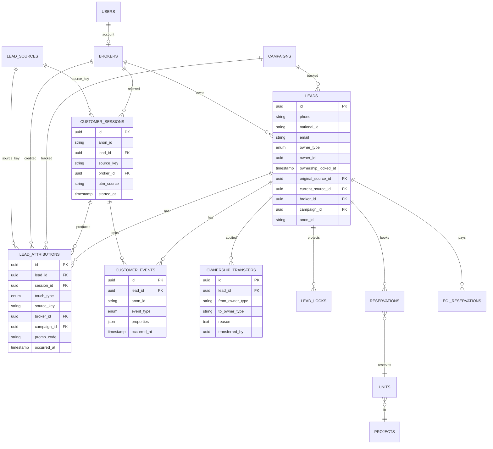
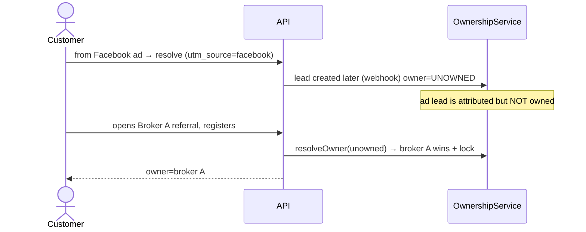
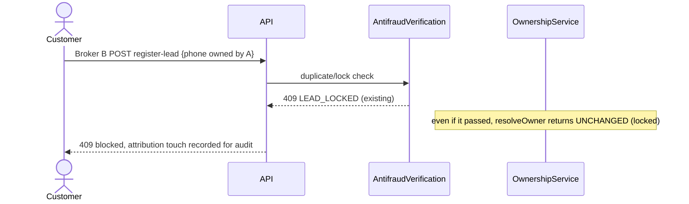
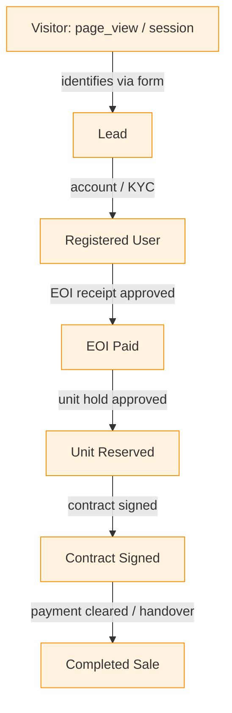

# REDP — Lead Attribution & Broker Protection System

**Status:** Design + foundational implementation
**Scope:** Enterprise lead attribution, multi-touch tracking, broker ownership protection, audit, and CRM analytics for the REDP real-estate booking platform.
**Audience:** Backend engineers, CRM/ops, frontend, QA.

> This document is the single source of truth for the attribution system. It is written **against the existing REDP codebase** (`backend/`, Laravel + Sanctum + MySQL + multi-tenant). Each artifact is annotated **EXISTS** (already in the repo), **EXTEND** (modify existing), or **NEW** (added by this work).

---

## 0. What already exists vs. what is new

The platform already ships a large part of this system. We **extend, not rebuild**.

| Capability | State | Where |
|---|---|---|
| Lead with `source`, `campaign_id`, `broker_id`, tier fields | EXISTS | `app/Models/Lead.php`, `…create_leads_table` |
| Broker with unique `referral_code` + `referral_url` accessor | EXISTS | `app/Models/Broker.php` |
| 90-day anti-poaching lock + OTP | EXISTS | `app/Models/LeadLock.php`, `AntiPoachingService` |
| Campaign with UTM (`utm_source/medium/campaign`) + CAC | EXISTS | `app/Models/Campaign.php` |
| Rich audit log (device, browser, geo, old/new, session) | EXISTS | `app/Models/AuditLog.php`, `AuditLogService` |
| Immutable client journey log | EXISTS | `app/Models/ClientJourneyLog.php` |
| Duplicate-identity / organic-lead / lock middleware | EXISTS | `app/Http/Middleware/AntifraudVerification.php` |
| Facebook / TikTok lead-ad webhooks | EXISTS | `SocialAdsWebhookController` |
| Round-robin lead assignment | EXISTS | `LeadAssignmentService` |
| **Normalized `lead_sources` catalog** | **NEW** | `LeadSource` |
| **Per-touch attribution (first/last/all touches, full UTM, device, geo)** | **NEW** | `LeadAttribution` |
| **Anonymous visitor sessions (pre-lead)** | **NEW** | `CustomerSession` |
| **Funnel events with timestamps** | **NEW** | `CustomerEvent` |
| **Broker `slug` + `qr_token` + `promo_code`** | **EXTEND** | `brokers` table |
| **Permanent first-broker-wins ownership + lock flag** | **EXTEND** | `leads` table (`owner_type`, `owner_id`, `ownership_locked_at`) |
| **Ownership transfer ledger (admin-only)** | **NEW** | `OwnershipTransfer` |
| **Identity resolution (phone→NID→email)** | **NEW** | `IdentityResolutionService` |
| **Attribution capture + public tracking endpoints** | **NEW** | `AttributionService`, `TrackingController` |
| **Ownership state machine** | **NEW** | `OwnershipService` |

---

## 1. System Architecture

### 1.1 High-level

```
                         ┌──────────────────────────────────────────────┐
   Customer browser /    │                 EDGE / CDN                    │
   mobile app / QR scan  │  /r/{slug}, /api/v1/track/*  (no auth, CORS)  │
            │            └───────────────────┬──────────────────────────┘
            ▼                                 ▼
 ┌────────────────────┐        ┌──────────────────────────────────────────┐
 │  Tracking SDK (JS) │        │            Laravel API (Sanctum)          │
 │  - reads ?ref=/utm │        │                                           │
 │  - 1st-party cookie│        │  Controllers ──► Services ──► Models ──► DB│
 │  - attribution_id  │        │      │            │                       │
 │  - sends events    │        │      │            ├─ IdentityResolution   │
 └─────────┬──────────┘        │      │            ├─ AttributionService   │
           │ JSON              │      │            ├─ OwnershipService      │
           └──────────────────►│      │            ├─ AntiPoachingService  │
                               │      │            └─ AuditLogService       │
                               │      ▼                                     │
                               │   Events (LeadCreated, ReservationConfirmed│
                               │   OwnershipAssigned, OwnershipTransferred) │
                               │      │                                     │
                               │      ▼  Queues (notifications, geo lookup, │
                               │         campaign metric rollups)           │
                               └──────────────────────────────────────────┘
                                          │            │
                               ┌──────────▼───┐   ┌────▼─────────┐
                               │  MySQL (OLTP)│   │ Redis (cache, │
                               │  + read replica  │ session, queue)│
                               └──────────────┘   └──────────────┘
```

### 1.2 Layering (matches existing repo conventions)

- **Controllers** — thin; validate input, call services, return API Resources.
- **Services** (`app/Services/Acquisition/`) — all business rules; transactional. Two styles already in repo: static utility (`AuditLogService`) and injectable (`AntiPoachingService`). New services follow the **injectable** style.
- **Models** — Eloquent with `HasUuids`, `SoftDeletes`, `Auditable`, and `BelongsToTenant` where tenant-scoped.
- **Events/Listeners** — cross-domain decoupling (already used for `LeadCreated`, `ReservationConfirmed`).
- **Middleware** — `antifraud` (exists), plus tracking runs unauthenticated.
- **Repository pattern** — the codebase does **not** use repositories (direct Eloquent in services). We keep that convention for consistency; a thin repository layer is listed under *future scalability* only.

### 1.3 Core principle: identity + ownership are separate from attribution

- **Attribution** is *append-only history* — every touch is recorded forever (`lead_attributions`, `customer_events`). It never changes ownership by itself.
- **Ownership** is *single-valued, locked state* — exactly one `(owner_type, owner_id)` per customer, changed only by the ownership state machine (first-touch assignment) or an admin transfer.

This separation is what lets you "track ads while protecting brokers" at the same time.

---

## 2. Database Schema

All tables: `uuid` PK, `timestamps`, soft deletes where mutable, named indexes, loose FKs (matching existing migrations). `tenant_id` nullable on public-capture tables (anonymous visitors have no tenant yet).

### 2.1 NEW / EXTENDED tables

#### `lead_sources` (NEW) — normalized catalog of channels
| Column | Type | Notes |
|---|---|---|
| id | uuid PK | |
| key | string unique | `broker_referral`, `broker_qr`, `broker_invite`, `promo_code`, `facebook_ads`, `google_ads`, `instagram_ads`, `tiktok_ads`, `whatsapp_campaign`, `organic_search`, `direct`, `manual_entry`, `api_integration` |
| label | string | Display name |
| category | enum | `broker`, `paid_ads`, `organic`, `direct`, `manual`, `api` |
| is_broker_source | bool | drives ownership assignment |
| is_active | bool | |

Seeded once. Replaces the free-string `leads.source` enum over time (kept for back-compat).

#### `customer_sessions` (NEW) — anonymous visitor sessions (pre-lead)
| Column | Type | Notes |
|---|---|---|
| id | uuid PK | |
| anon_id | string, indexed | 1st-party cookie value (UUID) set on first visit |
| lead_id | uuid null, indexed | back-filled when visitor becomes a lead |
| session_token | string unique | per-session |
| source_key | string null | resolved channel |
| broker_id | uuid null, indexed | resolved from ref/qr/promo |
| campaign_id | uuid null | |
| utm_source / utm_medium / utm_campaign / utm_content / utm_term | string null | |
| landing_page | text null | |
| referrer | text null | |
| ip_address | string null | |
| country / city | string null | geo (async) |
| device / os / browser | string null | parsed UA |
| user_agent | text null | |
| started_at | timestamp | |
| last_seen_at | timestamp | |
| tenant_id | uuid null | |

Indexes: `anon_id`, `lead_id`, `broker_id`, `(source_key, created_at)`.

#### `lead_attributions` (NEW) — one row per *touch* + a derived first/last summary
| Column | Type | Notes |
|---|---|---|
| id | uuid PK | |
| lead_id | uuid, indexed | FK→leads (loose) |
| session_id | uuid null | FK→customer_sessions |
| touch_type | enum | `first`, `intermediate`, `last` (computed) |
| source_key | string | from `lead_sources.key` |
| broker_id | uuid null | broker credited for this touch |
| campaign_id | uuid null | |
| promo_code | string null | |
| utm_source / utm_medium / utm_campaign / utm_content / utm_term | string null | |
| landing_page / referrer | text null | |
| ip_address / country / city | string null | |
| device / os / browser | string null | |
| occurred_at | timestamp, indexed | |
| tenant_id | uuid null | |

Indexes: `(lead_id, occurred_at)`, `broker_id`, `campaign_id`, `source_key`.

> **First touch** = earliest row for the lead. **Last touch** = latest. We also denormalize summary fields onto `leads` (see below) for fast filtering, while keeping the full history here.

#### `customer_events` (NEW) — funnel events with timestamps
| Column | Type | Notes |
|---|---|---|
| id | uuid PK | |
| lead_id | uuid null, indexed | null while anonymous |
| session_id | uuid null | |
| anon_id | string null, indexed | |
| event_type | enum | `page_view`, `visitor`, `lead`, `registered`, `eoi_paid`, `unit_reserved`, `contract_signed`, `completed_sale`, `custom` |
| stage | enum null | funnel stage snapshot |
| properties | json | arbitrary payload (project_id, unit_id, amount…) |
| occurred_at | timestamp, indexed | |
| tenant_id | uuid null | |

Indexes: `(lead_id, occurred_at)`, `(event_type, occurred_at)`, `anon_id`.

#### `ownership_transfers` (NEW) — admin-only ownership ledger
| Column | Type | Notes |
|---|---|---|
| id | uuid PK | |
| lead_id | uuid, indexed | |
| from_owner_type / from_owner_id | string/uuid null | |
| to_owner_type / to_owner_id | string/uuid | `broker`, `agent`, `direct` |
| reason | text | mandatory |
| transferred_by | uuid | admin user id |
| created_at | timestamp | (no updates — append-only) |

#### `brokers` (EXTEND)
Add: `slug` (string unique, e.g. `elite-realty`), `qr_token` (string unique, opaque token printed in QR), `promo_code` (string unique null), `referral_clicks` (int default 0).

#### `leads` (EXTEND) — denormalized ownership + attribution summary
Add:
- `owner_type` enum null: `broker`, `agent`, `direct`
- `owner_id` uuid null (broker id or user id; null for direct)
- `ownership_locked_at` timestamp null — set when first owner wins; presence = locked
- `original_source_id` uuid null → lead_sources
- `current_source_id` uuid null → lead_sources
- `first_touch_at` / `last_touch_at` timestamp null
- `anon_id` string null, indexed (link back to pre-lead sessions)

> `broker_id` (existing) remains the broker FK; `owner_*` generalizes ownership to also cover agent/direct and carries the **lock**.

### 2.2 Entity relationships (text)

- `lead_sources` 1─* `lead_attributions`, 1─* `customer_sessions` (via `source_key`)
- `customer_sessions` 1─* `lead_attributions`, 1─* `customer_events`
- `leads` 1─* `lead_attributions`, 1─* `customer_events`, 1─* `ownership_transfers`, 1─* `lead_locks` (EXISTS)
- `brokers` 1─* `leads` (owner), 1─* `customer_sessions`, 1─* `lead_attributions`
- `campaigns` 1─* `leads`, 1─* `lead_attributions`
- `leads` 1─* `reservations`/`eoi_reservations` (EXISTS) → `units` (EXISTS)

---

## 3. ER Diagram



---

## 4. Laravel Folder Structure (additions)

```
backend/app/
├── Http/Controllers/Acquisition/
│   ├── TrackingController.php          # NEW  public: ref/qr/promo resolve + event ingest
│   └── OwnershipController.php         # NEW  admin: transfer + ownership timeline
├── Services/Acquisition/
│   ├── IdentityResolutionService.php   # NEW  phone→NID→email dedupe
│   ├── AttributionService.php          # NEW  session capture, touch recording, owner resolution
│   ├── OwnershipService.php            # NEW  first-broker-wins state machine + transfers
│   └── AntiPoachingService.php         # EXISTS (reused by OwnershipService)
├── Models/
│   ├── LeadSource.php                  # NEW
│   ├── CustomerSession.php             # NEW
│   ├── LeadAttribution.php             # NEW
│   ├── CustomerEvent.php               # NEW
│   └── OwnershipTransfer.php           # NEW
├── Events/Acquisition/
│   ├── OwnershipAssigned.php           # NEW
│   └── OwnershipTransferred.php        # NEW
└── Http/Resources/
    ├── LeadTimelineResource.php        # NEW
    └── AttributionResource.php         # NEW

backend/database/migrations/
├── ..._create_lead_sources_table.php
├── ..._create_customer_sessions_table.php
├── ..._create_lead_attributions_table.php
├── ..._create_customer_events_table.php
├── ..._create_ownership_transfers_table.php
├── ..._add_attribution_fields_to_brokers_table.php
└── ..._add_ownership_attribution_to_leads_table.php

backend/database/seeders/LeadSourceSeeder.php
```

---

## 5. API Endpoints

### 5.1 Public (no auth) — tracking
| Method | URI | Purpose |
|---|---|---|
| GET | `/r/{slug}` | Resolve broker slug, set cookie, 302 → frontend with `?ref=` |
| GET | `/api/v1/track/resolve` | Resolve `?ref=`/`?promo=`/`?qr=` + UTM → returns `attribution_id` + sets cookie, creates `customer_session` |
| POST | `/api/v1/track/event` | Ingest funnel/page events `{anon_id, event_type, properties}` |
| GET | `/api/v1/track/qr/{qr_token}` | Resolve QR token → broker, 302 with ref |

### 5.2 Public — lead creation (EXISTS, extended)
| Method | URI | Notes |
|---|---|---|
| POST | `/v1/brokers/register-lead` | EXISTS; now also writes attribution + ownership |
| POST | `/v1/public/eoi/submit` | EXISTS; now binds `anon_id`→lead + records `eoi_paid` event |
| POST | `/v1/webhooks/{facebook,tiktok}/leads` | EXISTS; now writes attribution rows |

### 5.3 Protected (Sanctum) — CRM / admin
| Method | URI | Purpose |
|---|---|---|
| GET | `/v1/acquisition/leads/{id}/timeline` | NEW unified timeline (touches + events + journey + audit) |
| GET | `/v1/acquisition/leads/{id}/attribution` | NEW first/last/all touches |
| POST | `/v1/acquisition/leads/{id}/transfer-ownership` | NEW admin-only transfer (reason required) |
| GET | `/v1/acquisition/leads/{id}/ownership-history` | NEW transfer ledger |
| GET | `/v1/acquisition/brokers/{id}/referral-links` | EXISTS; now returns slug/qr/promo URLs |
| GET | `/v1/acquisition/dashboard/attribution` | NEW dashboard aggregates (see §10) |

### 5.4 Standard envelope
All responses use the existing controller convention: `{ success, data, message }` with appropriate HTTP codes (`201` create, `409` ownership conflict, `403` poaching/permission, `422` validation).

---

## 6. Business Rules

1. **One owner per customer.** A lead has at most one `(owner_type, owner_id)`. Set once; locked via `ownership_locked_at`.
2. **First broker wins.** The first *broker* touch on an **unowned** lead assigns ownership and locks it. Subsequent broker touches are recorded as attribution history but do **not** change ownership.
3. **Ads never override a broker.** A broker-owned lead returning via Google/Facebook updates `current_source`/last-touch only; owner is unchanged.
4. **Direct ownership.** A lead that pays EOI with no broker context → `owner_type = direct`.
5. **Promo == referral.** Entering a broker promo code at registration/EOI assigns that broker as owner **iff** the lead is still unowned (same rule as #2).
6. **Identity is canonical.** Customer identity priority: **mobile → national_id → email**. Matching any with a higher/equal priority loads the existing customer; we never create duplicates.
7. **Lock supersedes anti-poaching window.** The existing 90-day `LeadLock` remains for OTP/commission timing, but ownership is **permanent** until an admin transfers it. `OwnershipService` is the authority.
8. **Admin-only transfer, always logged.** Every transfer writes `ownership_transfers` + `AuditLog` + fires `OwnershipTransferred`.
9. **Attribution is append-only.** Touch/event rows are never updated or deleted (soft-delete disabled on those tables).
10. **Every funnel step is timestamped** in `customer_events` and reflected on the lead.

---

## 7. Lead Ownership Workflow (state machine)

```
States:  UNOWNED ──► OWNED(broker|agent|direct) ──► (admin transfer) ──► OWNED(new)
                          │
                          └── locked: ownership_locked_at set

resolveOwner(lead, context):
  if lead.ownership_locked_at != null:        # already owned
      record attribution touch (history only)
      update current_source / last_touch
      return UNCHANGED
  else:                                        # unowned
      if context has broker (ref/qr/promo/broker-referral):
          assign owner = broker; lock; fire OwnershipAssigned
      elif context is direct paid (EOI w/o broker):
          assign owner = direct; lock
      else:
          leave UNOWNED (still a lead, attributed to ad/organic; assignable later)
```

Transfer (admin):
```
transfer(lead, toOwner, reason, admin):
  assert admin
  assert reason present
  old = (lead.owner_type, lead.owner_id)
  DB::transaction:
     write ownership_transfers(old → new, reason, admin)
     update lead owner_*, keep ownership_locked_at
     (optionally release/replace LeadLock)
     AuditLog 'OWNERSHIP_TRANSFER'
     fire OwnershipTransferred
```

---

## 8. Sequence Diagrams

### 8.1 Referral link → booking (broker wins, survives later ad)
```mermaid
sequenceDiagram
    actor C as Customer
    participant FE as Frontend
    participant API as Laravel API
    participant ATT as AttributionService
    participant OWN as OwnershipService
    participant DB as MySQL

    C->>API: GET /r/elite-realty
    API->>DB: find broker by slug
    API-->>C: 302 to FE?ref=BKR001 (Set-Cookie redp_anon, redp_ref)
    C->>API: GET /api/v1/track/resolve?ref=BKR001&utm_source=fb
    API->>ATT: captureSession(cookies, query, request)
    ATT->>DB: insert customer_session (broker, utm, geo)
    API-->>C: {attribution_id, anon_id}
    Note over C: browses, later returns from Google
    C->>API: POST /api/v1/track/event {anon_id, page_view, utm_source=google}
    API->>ATT: recordEvent (history only)
    C->>API: POST /v1/brokers/register-lead {phone, ref}
    API->>OWN: resolveOwner(lead, ctx broker=BKR001)
    OWN->>DB: lead unowned → set owner=broker, lock
    OWN->>ATT: recordTouch(first=referral)
    API-->>C: 201 lead + owner=broker
    Note over C: EOI paid → reservation; owner stays BKR001
```

### 8.2 Ad lead, then broker referral (broker claims unowned)


### 8.3 Broker B tries to hijack owned lead


---

## 9. Customer Journey Diagram



Each transition writes a `customer_events` row (`event_type`, `occurred_at`) and maps to existing models:
| Funnel stage | event_type | Backed by (EXISTS) |
|---|---|---|
| Visitor | `visitor` / `page_view` | `customer_sessions` (NEW) |
| Lead | `lead` | `leads` |
| Registered | `registered` | `users` / `leads.kyc_status` |
| EOI Paid | `eoi_paid` | `eoi_reservations` (status approved) |
| Unit Reserved | `unit_reserved` | `reservations` (confirmed) |
| Contract Signed | `contract_signed` | `contracts` (`ContractSigned` event) |
| Completed Sale | `completed_sale` | `payments` cleared / handover |

---

## 10. Dashboard Wireframes

### 10.1 Attribution Overview (Admin)
```
┌───────────────────────────────────────────────────────────────────────────┐
│ Attribution Dashboard            [Date range ▾] [Project ▾] [Export CSV]     │
├───────────────┬───────────────┬───────────────┬───────────────┬────────────┤
│ TOTAL LEADS   │ EOI CONV.     │ RESERVATION   │ SALES RATE    │ REVENUE     │
│   12,480      │   18.2%       │   9.4%        │   5.1%        │ 312.4M EGP  │
├───────────────┴───────────────┴───────────────┴───────────────┴────────────┤
│  Leads by Source (donut)        │  Funnel (Visitor→…→Sale, bar)             │
│   ● Broker 38%  ● FB 22%        │   ▇▇▇▇▇▇▇▇  Visitor 40k                    │
│   ● Google 17% ● Organic 12%    │   ▇▇▇▇▇     Lead 12k                       │
│   ● Direct 7%  ● TikTok 4%      │   ▇▇▇       EOI 2.2k                       │
│                                 │   ▇▇        Reserved 1.1k                  │
│                                 │   ▇         Sale 640                       │
├─────────────────────────────────┴───────────────────────────────────────────┤
│  Top Brokers              │ Top Campaigns           │ Daily Leads (line)      │
│  1 Elite Realty  240 / 31 │ FB-RAMADAN  1.2k / 4.1% │   ╱╲   ╱╲╱              │
│  2 Nile Homes    180 / 22 │ GG-BRAND    980 / 3.2%  │  ╱  ╲_╱                 │
│  (leads / sales)          │ (leads / conv)          │                         │
└─────────────────────────────────────────────────────────────────────────────┘
```

### 10.2 Lead Timeline (drill-in)
```
┌──────────────────────────────────────────────────────────────┐
│ Ali Fahmy  +20101…  | Owner: Elite Realty (🔒 locked)  [Transfer]│
├──────────────────────────────────────────────────────────────┤
│  ● 12 Jun 10:02  First touch  — Broker Referral (Elite Realty) │
│  ● 12 Jun 10:30  page_view    — utm google/cpc                 │
│  ● 13 Jun 09:14  registered   — KYC verified                   │
│  ● 14 Jun 16:40  eoi_paid     — 50,000 EGP  (order EOI-2026-…) │
│  ● 16 Jun 11:00  unit_reserved— Unit A104                      │
│  ● 20 Jun 12:00  contract_signed                              │
└──────────────────────────────────────────────────────────────┘
```

Dashboard aggregate endpoint returns: `total_leads`, `leads_by_broker`, `leads_by_campaign`, `leads_by_source`, `eoi_conversion_rate`, `reservation_rate`, `sales_rate`, `revenue_by_broker`, `revenue_by_campaign`, `top_brokers`, `top_campaigns`, `daily/monthly/yearly` series.

---

## 11. Edge Cases

| # | Scenario | Rule | Result |
|---|---|---|---|
| 1 | Broker A link, then returns via Google | locked-stays | Owner = A; Google recorded as last-touch |
| 2 | Facebook ad first, broker referral later (unowned) | first-broker-wins on unowned | Broker becomes owner |
| 3 | Broker B registers a phone owned by A | locked + antifraud | `409 LEAD_LOCKED`; attribution touch logged |
| 4 | EOI paid with no broker | direct ownership | Owner = Direct |
| 5 | Same person, different phone but same NID | identity priority NID | Loads existing customer; no duplicate |
| 6 | Cookie manually edited / forged `ref` | server validates broker `active` + signs cookie; mismatch ignored | Falls back to organic; suspicious flag in audit |
| 7 | Two brokers' links clicked before identification | first **identified** broker touch on registration wins | Deterministic; earlier click is intermediate touch |
| 8 | Lead created by ad, later admin assigns broker | unowned→admin transfer | Allowed; logged |
| 9 | Promo code of suspended broker | broker must be `active` | Rejected; lead stays unowned |
| 10 | Anonymous events then registration | `anon_id` back-fills `lead_id` on all prior sessions/events | Full pre-lead history attached |
| 11 | Webhook duplicate (same FB lead twice) | dedupe by external id + phone | Single lead; second is attribution touch |
| 12 | Reservation expires (existing cron) | `Reservation::checkAndReleaseExpired()` | Event `unit_reserved` not added to completed funnel; owner unchanged |
| 13 | Clock/timezone | store UTC, render tenant TZ | Consistent ordering of touches |

---

## 12. Security & Anti-Fraud

- **Signed, http-only cookies** for `redp_anon` and `redp_ref` (Laravel signed cookies) — manual tampering invalidates them; server re-validates broker on every resolve.
- **Server-side validation of referral ownership**: `ref`/`qr`/`promo` must map to a broker with `status = active`; otherwise treated as organic and an audit `SUSPICIOUS_REFERRAL` entry is written.
- **Broker hijack prevention**: `OwnershipService.resolveOwner` returns UNCHANGED on locked leads; `AntifraudVerification` (EXISTS) blocks duplicate-identity/lock at the edge.
- **Duplicate prevention**: `IdentityResolutionService` enforces phone→NID→email canonicalization inside a DB transaction with a unique check.
- **Rate limiting** on `/api/v1/track/*` and `/r/{slug}` (per IP + per anon_id) to stop referral-click inflation.
- **Idempotent event ingestion** via optional client `event_id`.
- **All ownership changes + suspicious activity** logged via existing `AuditLogService` (captures IP, device, geo, session).
- **PII**: phone/NID stored as-is today; recommend column-level encryption + hashing index as a follow-up (see §13).

---

## 13. Future Scalability (to millions of users)

1. **Partition append-only tables** (`customer_events`, `lead_attributions`) by month; archive cold partitions to object storage / a warehouse.
2. **Move event ingestion to a queue** (Redis → batch insert) and a separate write path; the API just enqueues. (Codebase already has jobs/queues.)
3. **Read replica + CQRS for dashboards**: nightly rollups into `attribution_daily_rollups` so the dashboard never scans raw events.
4. **Geo enrichment async** (queued job) instead of inline.
5. **ClickHouse / BigQuery** mirror for analytics at scale; Laravel only owns OLTP truth (ownership, identity).
6. **Hashed identity index** (`phone_hash`, `nid_hash`) for fast dedupe without exposing PII; encrypt raw columns.
7. **Repository layer** if query reuse grows; today direct Eloquent in services is fine.
8. **Multi-region cookies** via a dedicated tracking subdomain to keep cookies 1st-party.
9. **Attribution models** beyond first/last: add `linear`, `time_decay`, `position_based` computed from the existing touch history without schema change.
10. **Outbox pattern** for cross-service events when the monolith is split.

---

## 14. Implementation status in this repo

**Delivered now (foundational, runnable):** migrations for the 5 new tables + 2 alters, the 5 models, `LeadSourceSeeder`, `IdentityResolutionService`, `AttributionService`, `OwnershipService`, `TrackingController`, `OwnershipController`, and route wiring.

**Remaining (clear roadmap, not yet wired):** dashboard aggregate endpoint queries, frontend tracking SDK + wireframe screens, back-filling existing webhooks/EOI to call `AttributionService`, queued geo enrichment, daily rollups, and the test suite (PHPUnit cases listed in `broker_mediation_requirements.md` §7 plus new ownership/identity/attribution tests).

See the migrations and services under `backend/` for the concrete code.
```
